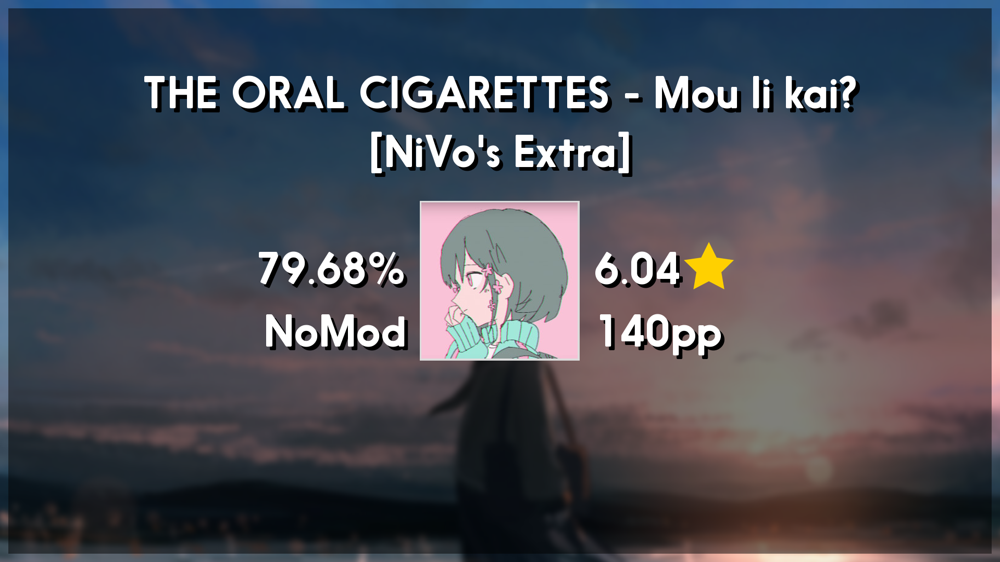

# osr2png - rewrite-rewrite [0.6.1]
This version and onwards will not have GUI as making GUI is fucking gay</br>
Old GUI version is still available [Here](https://github.com/FireRedz/osr2png/releases/tag/0.5)

## what's new in this version
more or the less the same thing but since theres no GUI i can add more stuff easily without having to care about updating it, but here the changelog anyway
```
    * Background blur
    * Background border
    * Added two generic osu! thumbnail style, more might come idk kinda lazy bruh
    * A little bit more customizable than before
    * Filename format
```
Note that the actual big changes is the codebase itself.

## Disclaimer 
You might have to change the font to something else because Nanami Rounded (The font) is unmonetizable.
You can use other coolass fonts from Google Font [Fredoka, Padauk, etc...] which is free to use.


## Preview



## Contact
Discord: FireRedz#7765
