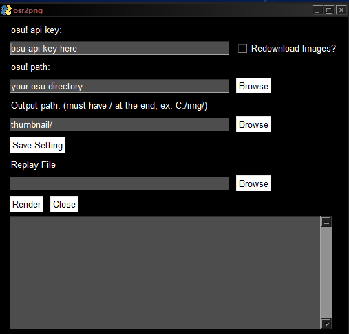
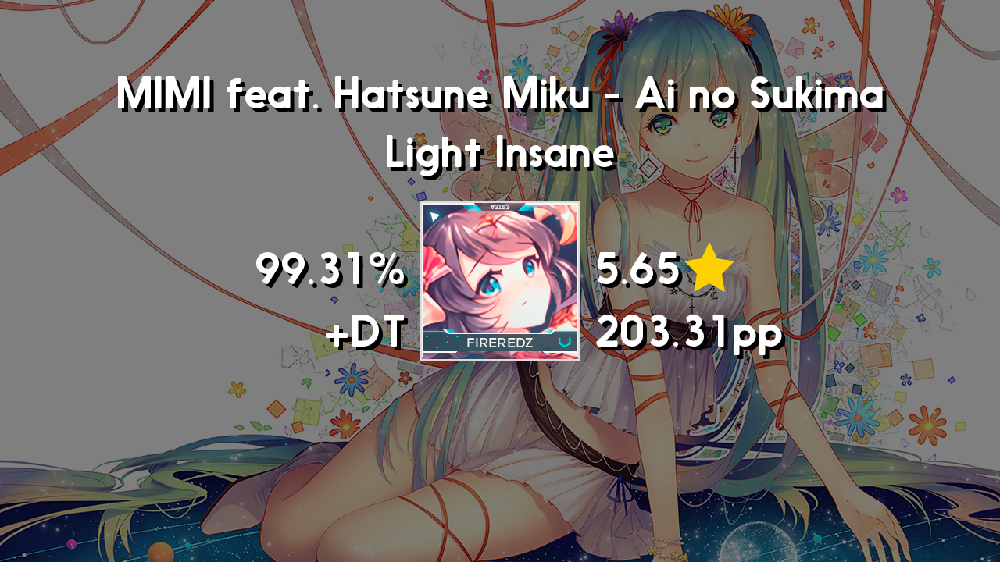

# osr2png
A program that converts osu! replay file into thumbnail.

## Disclaimer 
This application uses Nanami Rounded (Font), which is not suitable for monetized video. (Free for personal use only) 
You can use fonts from Google Fonts like Fredoka, Padauk, etc... Which is free for commercial use.

## Preview

## Requirements
* requests
* Pillow
* osrparse
* gooey

## How to use
Run the runner_gui.py (or the app.exe if you're using the exe version) to generate `settings.json`, then insert your `osu! api key` and `osu! directory` into the `settings.json`.

oh yea also when inserting the `osu! directory` make sure you change the `\` to `/` or `\\`
